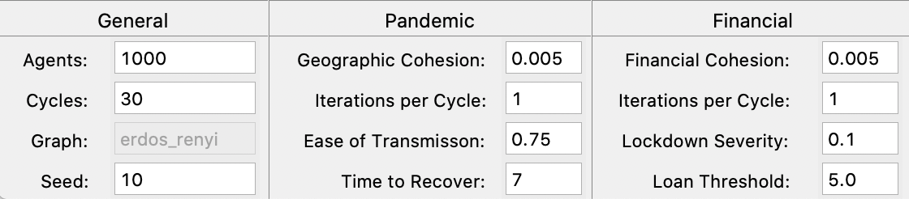
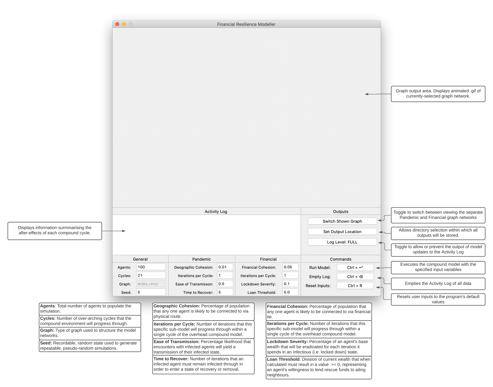

# Financial Resilience Modeller

Interface to an agent-based model aimed at examining shock propagation between financial entities during the covid-19 pandemic.

## Example Simulation

Example Model Variables
:----------------------------------------------------:

:----------------------------------------------------:
Example Model .GIFs
:----------------------------------------------------:
Pandemic                  |  Financial
:------------------------:|:-------------------------:
 |  

## GUI Instructions



### Environment Configuration

The virtual environment has been configured using [Poetry](https://python-poetry.org/docs/cli/), the modern solution for package/environment management. Please adhere to its docs when adding/removing/maintaining packages.

#### Operating System

This program will function as intended on Darwin OS alone.

#### Development Commands

```bash
poetry shell
poetry install
poetry run python Application/GUI.py
```

#### House-keeping Commands

```bash
poetry run black Application/*
poetry run pylint Application/*
poetry run pyinstaller --onefile --noconfirm --noconsole --clean PyI.spec
```

##### WARNING: Bokeh Plotting

As of v.2.0.0+, Bokeh has replaced PhantomJS when generating PNG exports. Bokeh now uses Selenium for the purpose of headless browser-ing within which the JavaScript-based plots can be rendered. This requires a Chromium or Firefox-based browser to be installed on the user's system. This program will attempt to first utilise Chromium and grab the corresponding web driver version to to what is installed locally, and failing that, the same process will be attempted with Firefox.

**tl;dr:** Install a Chromium or Firefox-based browser to use this program.
